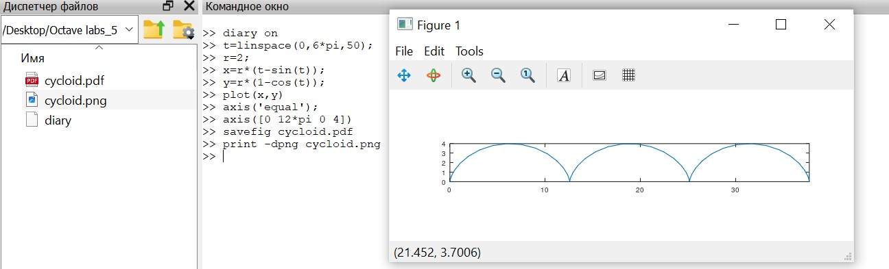
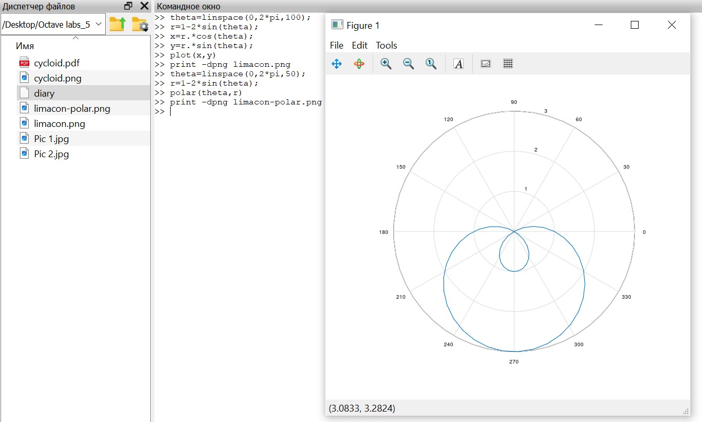
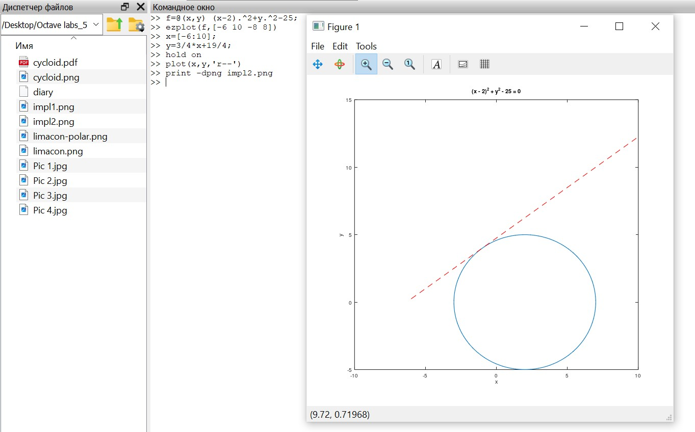
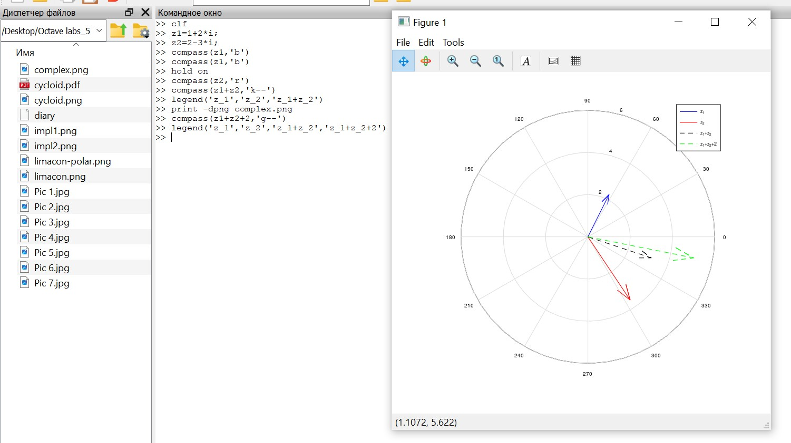
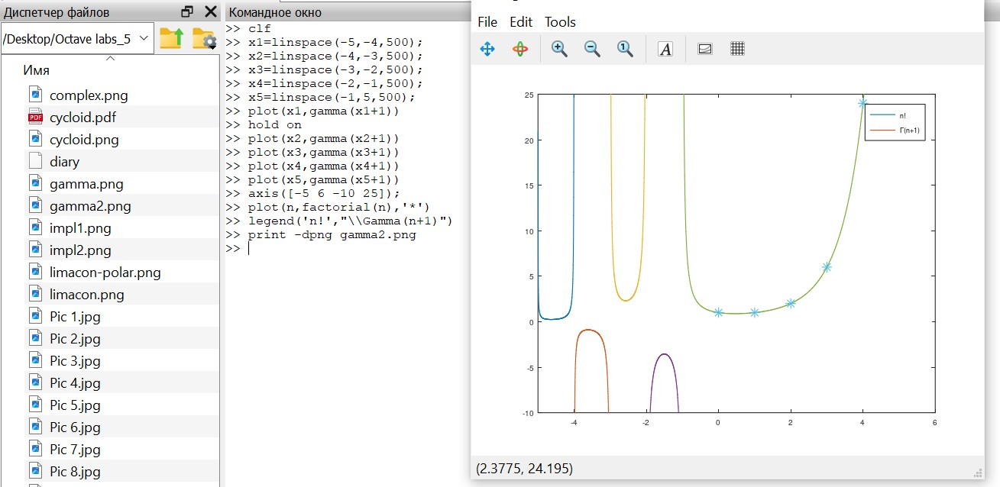

---
## Front matter
lang: ru-RU
title: Лабораторная работа №7
subtitle: Научное программирование
author:
  - Таубер Кирилл Олегович
institute:
  - Российский университет дружбы народов
  - Москва, Россия
date: 3 февраля 2024

## i18n babel
babel-lang: russian
babel-otherlangs: english

## Formatting
mainfont: PT Serif
romanfont: PT Serif
sansfont: PT Sans
monofont: PT Mono
toc: false
slide_level: 2
theme: metropolis
header-includes: 
 - \metroset{progressbar=frametitle,sectionpage=progressbar,numbering=fraction}
 - '\makeatletter'
 - '\beamer@ignorenonframefalse'
 - '\makeatother'
aspectratio: 43
section-titles: true
---

## Цель лабораторной работы

Изучить в Octave методы построения различных графиков и работы с комплексными числами и специальными функциями

## Теоретическое введение

__Гамма функция__ находит очень широкое применение в прикладном анализе. С гамма-функцией связаны функции Бесселя используемые при синтезе фильтров и спектральном анализе. В статистике широко используется гамма-распределение, частными случаями которого являются экспоненциальное распределение и распределение хи-квадрат.

Данная функция не выражается через элементарные функции, но может быть представлена как интеграл вида: $$\Gamma(x)=\int_0^\infty t^{x-1}e^{-t}\,\mathrm{d}t.$$

Для натуральных значений аргумента гамма-функция совпадает со значением факториала: $$\Gamma(n)=(n-1)!, n=1,2,3,4,...$$
При этом для любых комплексных значений $z$ справедливо равенство: $$\Gamma(z+1)=z \Gamma(z).$$

## Ход выполнения лабораторной работы
- Параметрические уравнения для циклоиды:

$$x=r(t-sin(t)), y=r(1-cos(t)).$$

Построили график трех периодов циклоиды радиуса 2

{ #fig:001 width=70% }

## Ход выполнения лабораторной работы
- Построили улитку Паскаля $r=1-2sin(\theta)$ в полярных осях

{ #fig:003 width=70% }

## Ход выполнения лабораторной работы
- Построили функцию, неявно определенную уравнением вида $f(x,y)=0,$ в частности, кривую, определяемую уравнением $-x^2-xy+x+y^2-y=1.$

{ #fig:004 width=55% }

## Ход выполнения лабораторной работы

- Нашли уравнение касательной к графику окружности $(x-2)^2+y^2=25$ в точке $(-1,4)$ и построили график окружности и касательной 

{ #fig:005 width=60% }

## Ход выполнения лабораторной работы
- Вывели основные арифметические операции с комплексными числами $z_1=1+2i, z_2=2-3i$

{ #fig:006 width=50% }

## Ход выполнения лабораторной работы

- Построили графики $z_1, z_2, z_1+z_2, z_1+z_2+2$ в комплексной плоскости

{ #fig:008 width=75% }

## Ход выполнения лабораторной работы

- Построили функции $\Gamma(x+1)$ и $n!$ на одном графике

{ #fig:011 width=80% }

## Вывод
- В ходе выполнения данной лабораторной работы я изучила в Octave методы построения различных графиков и работы с комплексными числами и специальными функциями

