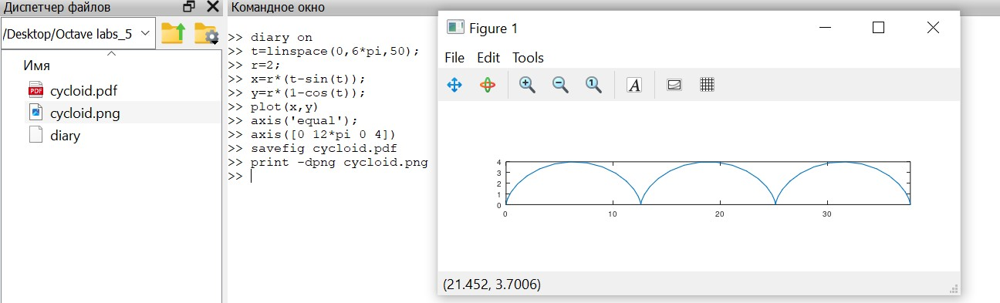
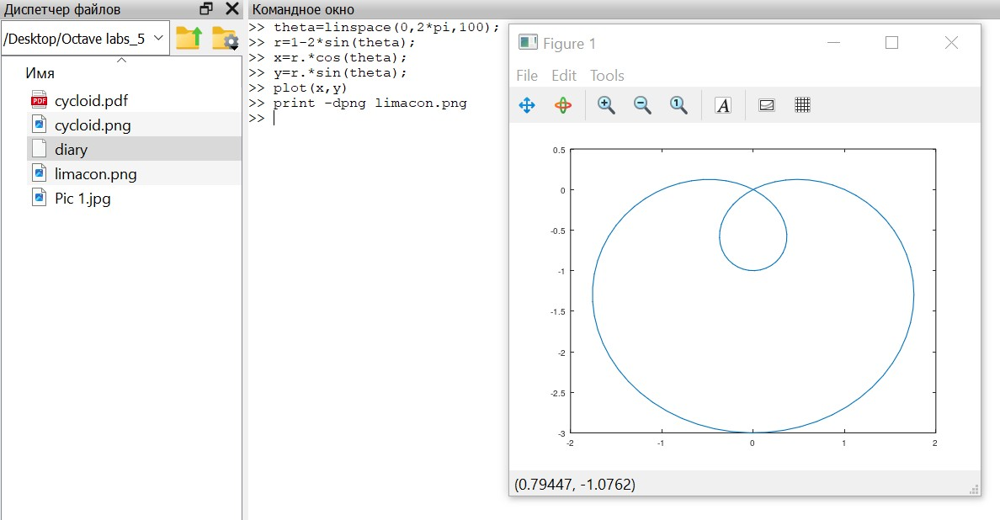
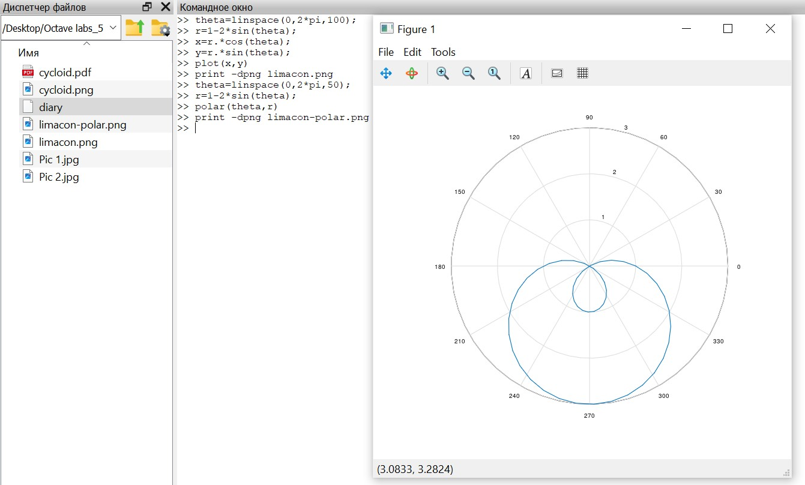
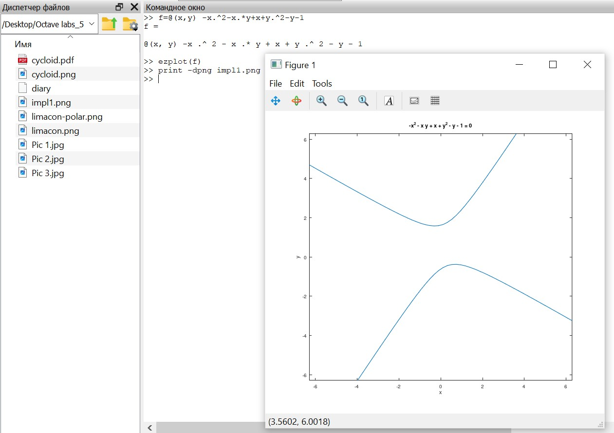
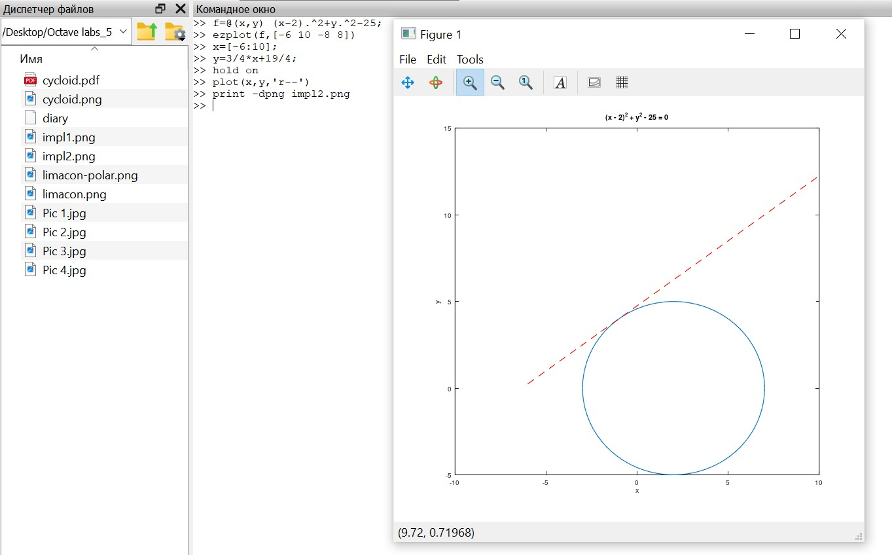
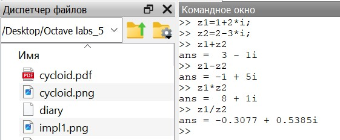
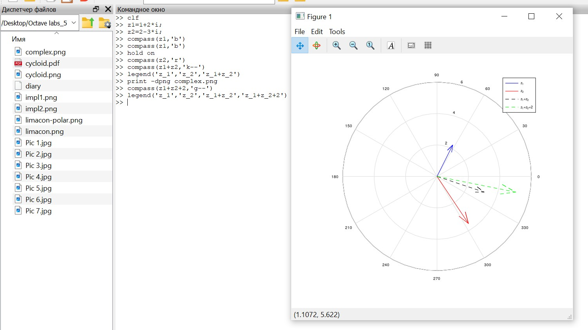
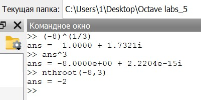
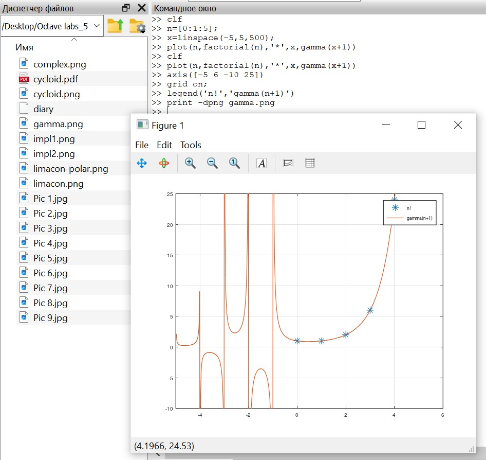
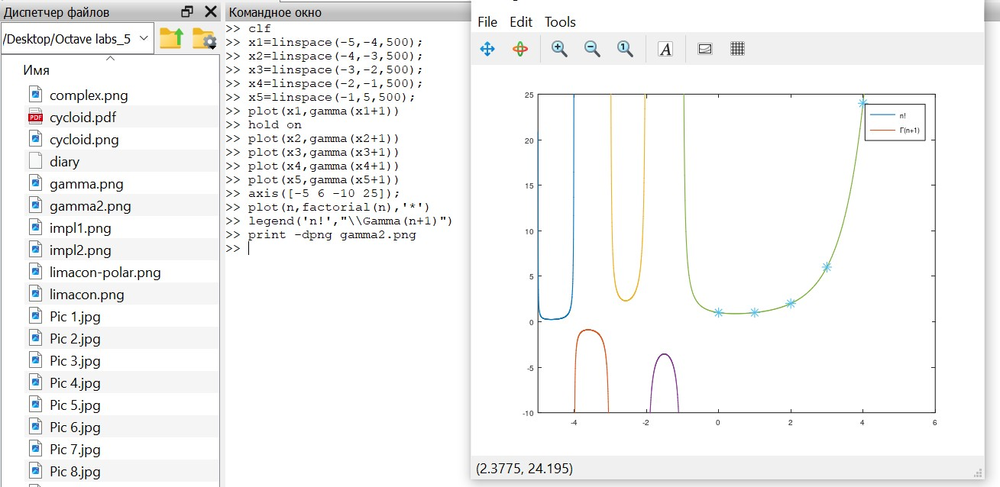

---
## Front matter
title: "Лабораторная работа №7"
subtitle: "Научное программирование"
author: "Таубер Кирилл Олегович"

## Generic otions
lang: ru-RU
toc-title: "Содержание"

## Bibliography
bibliography: bib/cite.bib
csl: pandoc/csl/gost-r-7-0-5-2008-numeric.csl

## Pdf output format
toc: true # Table of contents
toc-depth: 2
lof: true # List of figures
fontsize: 12pt
linestretch: 1.5
papersize: a4
documentclass: scrreprt
## I18n polyglossia
polyglossia-lang:
  name: russian
  options:
	- spelling=modern
	- babelshorthands=true
polyglossia-otherlangs:
  name: english
## I18n babel
babel-lang: russian
babel-otherlangs: english
## Fonts
mainfont: PT Serif
romanfont: PT Serif
sansfont: PT Sans
monofont: PT Mono
mainfontoptions: Ligatures=TeX
romanfontoptions: Ligatures=TeX
sansfontoptions: Ligatures=TeX,Scale=MatchLowercase
monofontoptions: Scale=MatchLowercase,Scale=0.9
## Biblatex
biblatex: true
biblio-style: "gost-numeric"
biblatexoptions:
  - parentracker=true
  - backend=biber
  - hyperref=auto
  - language=auto
  - autolang=other*
  - citestyle=gost-numeric
## Pandoc-crossref LaTeX customization
figureTitle: "Рис."
tableTitle: "Таблица"
listingTitle: "Листинг"
lofTitle: "Список иллюстраций"
lolTitle: "Листинги"
## Misc options
indent: true
header-includes:
  - \usepackage{indentfirst}
  - \usepackage{float} # keep figures where there are in the text
  - \floatplacement{figure}{H} # keep figures where there are in the text
---

# Цель работы

Изучить в Octave методы построения различных графиков и работы с комплексными числами и специальными функциями.

# Теоретическое введение
Основной функцией для построения __двумерных графиков__ в Octave служит функция plot. У функции несколько вариантов вызова:

* plot(X, Y) - в данном случае будет построен график зависимости у(х). Значения у и х берутся из матриц Y и X, которые могут быть либо вектором-столбцом, либо вектором-строкой одинаковой размерности;

* plot(Xl,Yl,...,Xn,Yn) - будут одновременно построены несколько функциональных зависимостей у(х), при этом параметры линий на графике будут выбраны Octave самостоятельно;

* plot(X,Y,LineSpec), plot(Xl,Yl,LineSpecl,...,Xn,Yn,LineSpecn) — наиболее полный вариант вызова функции построения двумерных графиков с заданием параметров графических линий. LineSpec - это шаблон, с помощью которого определяется цвет линии, ее толщина, вид маркеров и другие параметры. Шаблон представляет собой взятое в апострофы название параметра, отделенное запятой от его значения.

Один из способов построения __трехмерных графиков__ связан с использованием функции surf. Наиболее часто функция вызывается в формате surf(X,Y, Z) или в surf(X, Y, Z, С). X и Y - векторы-строки, определяющие значения абсцисс и ординат. Z - матрица с размерностью, равной произведению размерностей матриц X и Y, задающая значения координаты z для соответствующих пар х и у. Параметр С определяет способ отображения трехмерной картинки (цвет, режим отображения кромок и т. д.).

__Гамма функция__ находит очень широкое применение в прикладном анализе. С гамма-функцией связаны функции Бесселя используемые при синтезе фильтров и спектральном анализе, а также другие специальные функции: бета-функция, К-функции, G-функции. В статистике широко используется гамма-распределение, частными случаями которого являются экспоненциальное распределение и распределение хи-квадрат.

Данная функция не выражается через элементарные функции, но может быть представлена как интеграл вида: $$\Gamma(x)=\int_0^\infty t^{x-1}e^{-t}\,\mathrm{d}t.$$

Для натуральных значений аргумента гамма-функция совпадает со значением факториала: $$\Gamma(n)=(n-1)!, n=1,2,3,4,...$$

При этом для любых комплексных значений $z$ справедливо равенство: $$\Gamma(z+1)=z \Gamma(z).$$

Более подробно см. в [@Octave_1:bash] и [@Octave_2:bash].

# Выполнение лабораторной работы

Параметрические уравнения для циклоиды:

$$x=r(t-sin(t)), y=r(1-cos(t)).$$

Построим график трех периодов циклоиды радиуса 2 (рис. @fig:001).

{#fig:001 width=110%}

Графики в полярных координатах строятся аналогично. Для функции $$r=f(\theta)$$ начинаем с определения независимой переменной $\theta$, далее вычисляем $r$. Чтобы построить график, вычислим $x$ и $y$, используя стандартное преобразование координат $$x=rcos(\theta), y=rsin(\theta),$$ затем строим график в осях $xy$. Построим улитку Паскаля $$r=1-2sin(\theta)$$ (рис. @fig:002).

{#fig:002 width=110%}

Построим функцию $$r=f(\theta)$$ в полярных осях, используя команду polar (рис. @fig:003).

{#fig:003 width=110%}

Теперь необходимо построить функцию, неявно определенную уравнением вида $$f(x,y)=0.$$ Для этого применяется команда ezplot. Построим кривую, определяемую уравнением $$-x^2-xy+x+y^2-y=1.$$ Чтобы определить функцию в виде $f(x,y)=0$, вычтем 1 из обеих частей уравнения. Зададим функцию в виде $\lambda$-функции и построим график (рис. @fig:004).

{#fig:004 width=110%}

Найдем уравнение касательной к графику окружности $$(x-2)^2+y^2=25$$ в точке $(-1,4)$ и построим график окружности и касательной. Для начала определим круг как функцию вида $f(x,y)=0$ и зададим функцию в виде $\lambda$-функции. Центр круга находится в точке $(2,0)$, а радиус равен $5$. Задаем оси нашего графика так, чтобы они несколько превосходили окружность. Используя правило дифференцирования неявной функции, найдем $$y'=\frac{2-x}{y}.$$ В точке $(-1,4)$ имеем $$y'|_{(-1,4)}=\frac{2-(-1)}{4}=\frac{3}{4}.$$ Таким образом, уравнение касательной линии будет иметь вид: $$y=\frac{3}{4}x+\frac{19}{4}.$$ Построим график (рис. @fig:005).

{#fig:005 width=110%}

Пусть $z_1=1+2i, z_2=2-3i$. Выведем основные арифметические операции с этими комплексными числами (рис. @fig:006).

{#fig:006 width=60%}

Построим график в комплексной плоскости, используя команду compass. Пусть $z_1=1+2i, z_2=2-3i$. Построим графики $z_1, z_2, z_1+z_2, z_1+z_2+2$ (рис. @fig:008).

{#fig:008 width=110%}

Вычислим $\sqrt[3]{-8}$ и проверим ответ. Чтобы вывести просто действительный корень, воспользуемся командой nthroot (рис. @fig:009).

{#fig:009 width=50%}

Гамма-функция определяется как $$\Gamma(x)=\int_0^\infty t^{x-1}e^{-t}\,\mathrm{d}t.$$ Это расширение факториала, так как для натуральных чисел $n$ гамма-функция удовлетворяет соотношению $$\Gamma(n)=(n-1)!.$$ Построим функции $\Gamma(x+1)$ и $n!$ на одном графике (рис. @fig:010).

{#fig:010 width=110%}

Поскольку вертикальные асимптоты на полученном графике в районе отрицательных чисел не являются истинной частью графика, а являются артефактами вычисления, то для их устранения разделим область значений на отдельные интервалы, что даст более точный график (рис. @fig:011).

{#fig:011 width=115%}

# Вывод 

В ходе выполнения данной лабораторной работы я изучила в Octave методы построения различных графиков и работы с комплексными числами и специальными функциями.

# Список литературы{.unnumbered}

